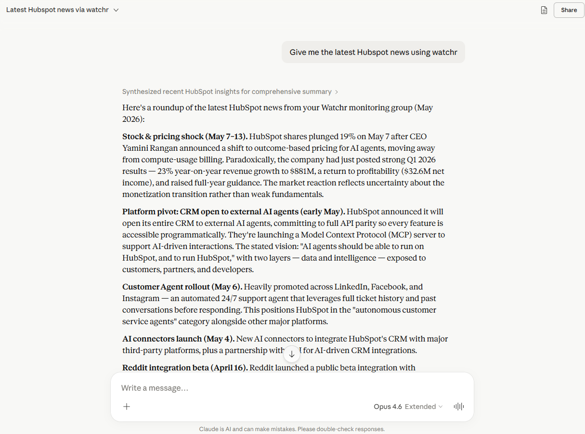
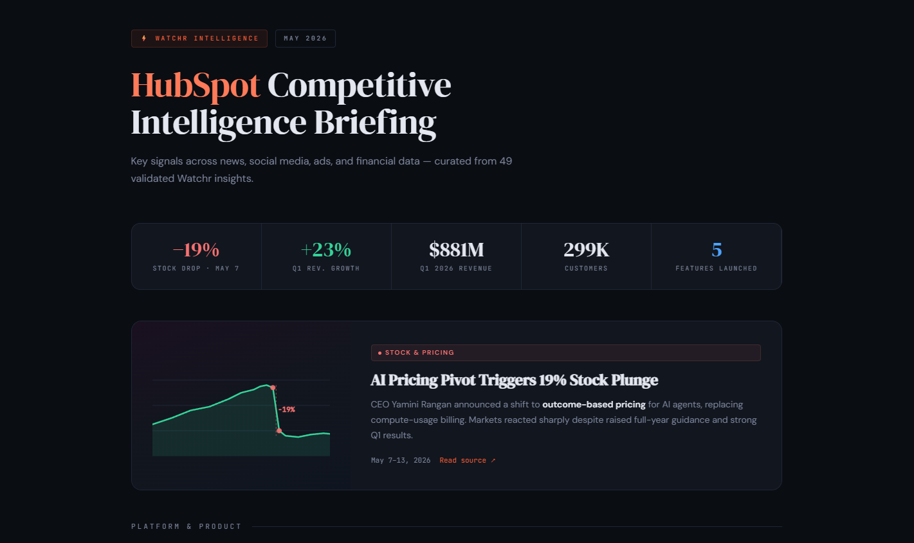
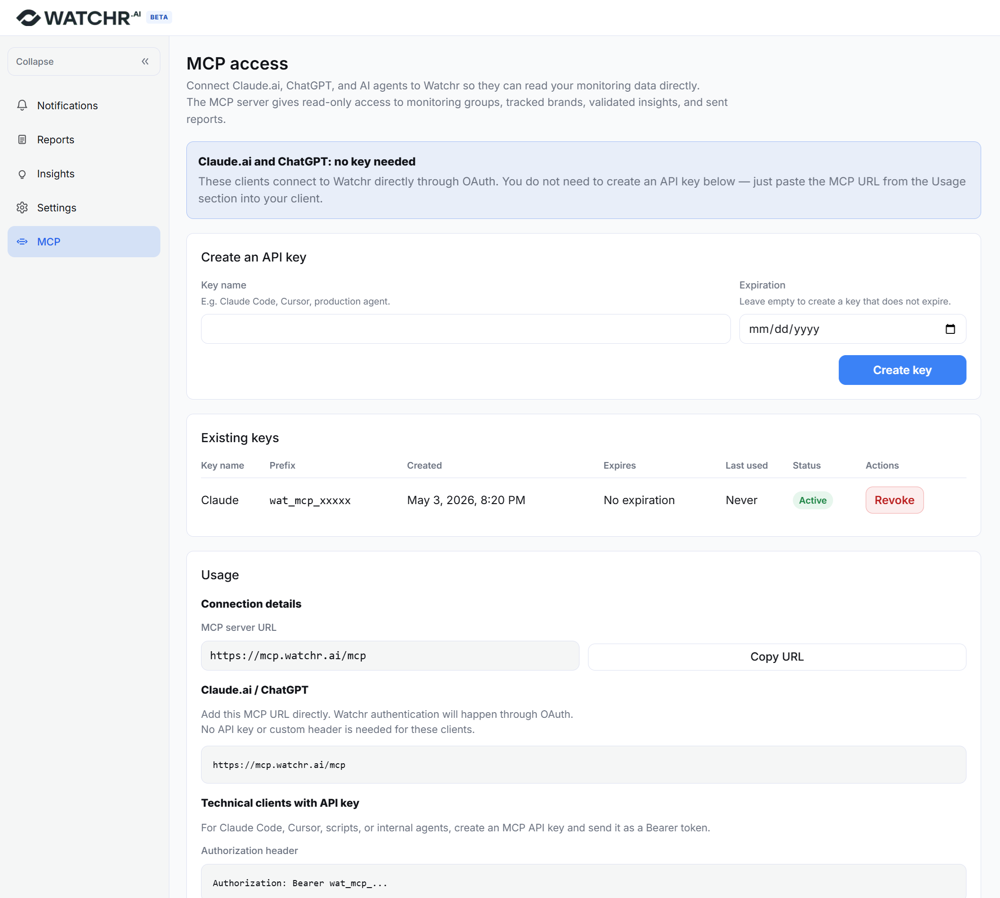

# Watchr MCP Server

> Bring competitive intelligence and brand monitoring into your AI assistant. Ask Claude, Cursor, or any MCP-compatible client what your competitors did this week. Answers come straight from your [Watchr](https://www.watchr.ai) workspace.

[Watchr](https://www.watchr.ai) is a competitive intelligence and brand monitoring platform. It watches your competitors' websites, ads, social posts, news, and other sources, then qualifies each signal against a prompt you define, so what you see is *relevant* movement, not noise.

This repository hosts the official **Model Context Protocol (MCP) server** for Watchr. It exposes your monitoring groups, tracked brands, validated insights, and sent reports to any MCP-compatible client. Read-only.

The server is hosted by Watchr. No local install, no Docker. Just point your client at `https://mcp.watchr.ai/mcp` and authenticate. There are two paths, depending on your client:

- One-click OAuth for Claude (Desktop / Code), ChatGPT, Cursor and any other client supporting Dynamic Client Registration. Browser opens, you approve, done.
- Personal API key (generated in your Watchr workspace) for agentic frameworks and custom integrations where you embed the MCP into your own automation stack.

---

## Table of contents

- [What you can do with it](#what-you-can-do-with-it)
- [Showcase](#showcase)
- [Available tools](#available-tools)
- [Getting started with Watchr](#getting-started-with-watchr)
- [Authentication](#authentication)
  - [Option A. One-click OAuth](#option-a-one-click-oauth)
  - [Option B. Personal API key](#option-b-personal-api-key)
- [Configuration](#configuration)
  - [OAuth clients](#oauth-clients)
  - [API key clients](#api-key-clients)
- [Improving your results](#improving-your-results)
- [Support](#support)

---

## What you can do with it

Once connected, you can ask your AI assistant things like:

- *"What did our competitors launch this week?"*
- *"Draft a Slack message summarizing the top 5 competitive insights from this month."*
- *"Compare positioning changes across our tracked brands over the last 30 days."*
- *"Build me a one-page competitive briefing on HubSpot from the last month, make it visual."*
- *"Automatically update my Notion battle cards and competitor recap pages with this week's Watchr insights."*

The MCP server provides the data; your assistant handles the reasoning, drafting, and integration with the rest of your workflow.

## Showcase

A short conversation with Claude pulling the latest HubSpot signals through Watchr:



Same data, one follow-up prompt later. Claude generates a designed competitive briefing artifact directly from the validated Watchr insights:



This is the core loop. Watchr collects and qualifies. Your AI client reasons and outputs. The MCP server is the glue.

## Available tools

The server exposes six read-only tools:

| Tool | Purpose |
|---|---|
| `list_monitoring_groups` | List all monitoring groups (watchlists) you have access to. Each group bundles one or more tracked brands and a custom qualifying prompt that defines what counts as relevant. |
| `list_brands` | List the competitor brands tracked inside a monitoring group. Use this to resolve brand names before searching. |
| `search_insights` | Search validated insights with filters (brand, date range, source type, free-text). Insights are the signals Watchr collected and qualified as relevant against the group's prompt. |
| `get_insight` | Fetch the full body of a single insight by ID: source URL, original content, screenshots, qualifying rationale. |
| `list_reports` | List reports that have been sent from a monitoring group. |
| `get_report` | Fetch the full body of a single report: narrative, included insights, recipients, send date. |

All endpoints are paginated and filterable. The server is read-only. It cannot create, edit, or delete anything in your Watchr workspace.

## Getting started with Watchr

You need a configured Watchr workspace before the MCP server has anything interesting to return. The full path:

1. Create an account at [watchr.ai/signup](https://www.watchr.ai/signup). A free tier is available.
2. Finalize your settings at [watchr.ai/app/settings](https://www.watchr.ai/app/settings):
   - Add the brands and competitors you want to track
   - Specify the market you are monitoring (used to qualify relevance)
   - Subscribe to the newsletters and press feeds you want pulled in
   - Add the pages you want Watchr to monitor for changes (pricing, changelog, careers, etc.)
   - Add social media profiles to scrape (LinkedIn, Facebook, Instagram)
3. Wait for your first report. Watchr collects, qualifies, and assembles the first briefing automatically.
4. Connect the MCP server (see [Authentication](#authentication) and [Configuration](#configuration)) and start querying your insights from any AI client.

## Authentication

The server endpoint is always `https://mcp.watchr.ai/mcp`. There are two ways to authenticate to it. Pick the one your client supports.

### Option A. One-click OAuth

Standard OAuth 2.1 with Dynamic Client Registration (RFC 7591) and PKCE. Your client self-registers, opens a browser window, you authorize Watchr access, and tokens are stored transparently by the client. No copy/paste, no manual rotation.

Clients with confirmed OAuth support out of the box:

- Claude Desktop
- Claude Code
- ChatGPT (Custom Connectors on Plus / Pro / Team / Enterprise)
- Cursor (recent versions)

If your client is in this list, jump straight to [OAuth clients](#oauth-clients). No key generation needed.

### Option B. Personal API key

For agentic frameworks, custom integrations, scripts, Windsurf, VS Code extensions, or any client that doesn't support OAuth, Watchr issues long-lived API keys prefixed with `wat_mcp_`.

To generate a key:

1. Sign in at [watchr.ai](https://www.watchr.ai)
2. Go to **Integrations → MCP** in your workspace
3. Click **Create API key**
4. Give it a descriptive name (e.g. *"My LangGraph agent"*, *"Windsurf, work laptop"*), optionally set an expiry date
5. Copy the key immediately. Watchr only displays the full key once. The dashboard stores a prefix and a hash, so a lost key cannot be recovered (revoke and regenerate).



Pass the key as a Bearer token on every request:

```
Authorization: Bearer wat_mcp_<your-key>
```

Most MCP clients let you declare this via a `headers` field in their config. Examples in [API key clients](#api-key-clients).

A few notes on security:

- Treat the key like a password. Read-only doesn't mean low-risk: it can see all your competitive intelligence.
- One key per device or integration, named clearly. Revoke and re-issue from **Integrations → MCP** if a laptop is lost.
- Set an expiry date on keys for CI or shared environments.
- Keys inherit your account's access. They cover every active monitoring group in the account.

Don't have a Watchr account yet? [Create one for free](https://www.watchr.ai/signup).

## Configuration

### OAuth clients

For all clients below, the server URL is `https://mcp.watchr.ai/mcp` and authentication is triggered automatically on first connection.

#### Claude Desktop

Edit `claude_desktop_config.json` (Settings → Developer → Edit Config):

```json
{
  "mcpServers": {
    "watchr": { "url": "https://mcp.watchr.ai/mcp" }
  }
}
```

Restart Claude Desktop. Watchr appears in the connectors panel. Click it to complete OAuth.

#### Claude Code

```bash
claude mcp add --transport http watchr https://mcp.watchr.ai/mcp
```

Then run `/mcp` inside Claude Code and click **Authenticate** next to Watchr.

#### ChatGPT

Settings → Connectors → **Add custom connector**:

- MCP server URL: `https://mcp.watchr.ai/mcp`
- Authentication: OAuth

ChatGPT triggers the OAuth flow on first use.

#### Cursor

Settings → MCP → **Add new MCP server**:

```json
{
  "watchr": { "url": "https://mcp.watchr.ai/mcp" }
}
```

### API key clients

First [generate an API key](#option-b-personal-api-key), then pass it as a Bearer token in the client config.

#### Windsurf

Add to `~/.codeium/windsurf/mcp_config.json`:

```json
{
  "mcpServers": {
    "watchr": {
      "serverUrl": "https://mcp.watchr.ai/mcp",
      "headers": { "Authorization": "Bearer wat_mcp_<your-key>" }
    }
  }
}
```

#### VS Code

Add to `.vscode/mcp.json` (or user settings):

```json
{
  "servers": {
    "watchr": {
      "type": "http",
      "url": "https://mcp.watchr.ai/mcp",
      "headers": { "Authorization": "Bearer wat_mcp_<your-key>" }
    }
  }
}
```

#### Cursor (without OAuth)

Same JSON shape as the OAuth version with an added `headers` block:

```json
{
  "watchr": {
    "url": "https://mcp.watchr.ai/mcp",
    "headers": { "Authorization": "Bearer wat_mcp_<your-key>" }
  }
}
```

#### Custom agentic frameworks

LangGraph, CrewAI, Mastra, n8n, custom Python or TypeScript agents, etc. Connect to `https://mcp.watchr.ai/mcp` over streamable HTTP and attach the header `Authorization: Bearer wat_mcp_<your-key>` to every request. Any MCP-compatible SDK works.

## Improving your results

If your assistant says it has "no relevant insights" or returns thin results, the data lives upstream in your Watchr workspace. Make Watchr smarter and the MCP gets smarter:

- Add monitored pages (competitor pricing, changelog, careers, product pages)
- Complete social profiles by adding LinkedIn, Facebook, Instagram handles for each tracked brand
- Refine the qualifying prompt at the monitoring-group level. It decides what counts as "relevant". Tighten it (more specific themes you care about) or broaden it (catch more) based on what's getting through.
- Add more news and press sources. The more sources, the higher the signal density.

Everything is configurable at [watchr.ai/app/settings](https://www.watchr.ai/app/settings).

## Support

- Bug reports and feature requests: [open an issue](https://github.com/getwatchr/watchr-mcp/issues) in this repo
- General questions and feedback: [contact@watchr.ai](mailto:contact@watchr.ai)
- Status and uptime: the MCP endpoint shares status with the main Watchr platform

---

Built by the [Watchr](https://www.watchr.ai) team. MIT licensed.
